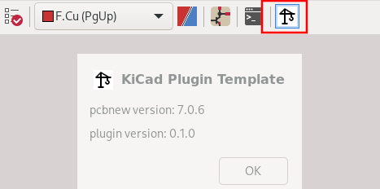

# KiCad Plugin Template

|         |                                                                                                                                                                                                                                                                                                                                                                                                                                                                                                                                                                                                                    |
| ---     | ---                                                                                                                                                                                                                                                                                                                                                                                                                                                                                                                                                                                                                |
| CI/CD   | [](https://github.com/adamws/kicad-plugin-template/actions/workflows/main.yml)  
| Meta    | [](https://github.com/pypa/hatch) [](https://github.com/astral-sh/ruff) [](https://github.com/psf/black) [](https://github.com/python/mypy) [](https://spdx.org/licenses/) |

-----

Project template for **[KiCad](https://www.kicad.org/)** [action plugins](https://dev-docs.kicad.org/en/python/pcbnew/).

**Table of Contents**

- [Key Features](#key-features)
- [How to use](#how-to-use)
  - [First build](#first-build)
  - [Hatch project manager](#hatch-project-manager)
  - [Testing](#testing)
  - [Github Actions](#github-actions)
- [License](#license)

## Key Features

- KiCad compatible plugin packaging with minimal configuration
- Custom [repository](https://adamws.github.io/kicad-plugin-template/) deployments for development builds
- Test setup example
- Lint tools configuration with sane defaults
- [Hatch](https://hatch.pypa.io/latest/) based for extra extensibility

## How to use

This is **template repository**.
You can create your own repository from that template using [this guide](https://docs.github.com/en/repositories/creating-and-managing-repositories/creating-a-repository-from-a-template).
Alternatively, clone/download this repository and use it as a starting point for your plugin.

### First build

After your plugin directory is ready, run:

```shell
hatch build --target kicad-package
```

After a while you should get output similar to this:

```shell
[kicad-package]
package details:
{
  "download_sha256": "6d9aa77cea16b5edee478e4eb36c4e2c2a1c012201240767329363f116563312",
  "download_size": 7961,
  "install_size": 9259
}
dist/kicad_plugin_template-0.1.0.zip
```

Build result is located in `dist/` directory. You can install it with KiCad's `Plugin and Content Manager` using `Install From File...` option:


To check if it is working, open `PCB Editor`. Plugin icon should be on the toolbar.
If everything is ok, clicking it will result in following window:




And that's it! You built working KiCad plugin. Now it's time to start modifying template.

### Hatch project manager

This template is using [hatch](https://hatch.pypa.io/latest) with [hatch-kicad](https://github.com/adamws/hatch-kicad) plugin.
Thanks to this build system it is possible to create KiCad compatible package file with single command.
All settings used in this process are located in `pyproject.toml` file.

At this stage you should start customizing project defaults. Open `pyproject.toml` and modify `kicad-package` section:

```toml
[tool.hatch.build.targets.kicad-package]
name = "Template"
# ...remaining options
```

These options controls plugin content and metadata. Metadata values will become important
when publishing to KiCad's plugin repository. To learn more about `kicad-package` builder see [this](https://github.com/adamws/hatch-kicad#builder).

Hatch is also used for running various actions in isolated environments.
There are two environments defined:

```toml
[tool.hatch.envs.default]
# ...
[tool.hatch.envs.lint]
# ...
```

Project environment can be used with [hatch run](https://hatch.pypa.io/latest/cli/reference/#hatch-run)
or [hatch shell](https://hatch.pypa.io/latest/cli/reference/#hatch-shell) command.
For example, to get linting results using `ruff`, `black` and `mypy`, run:

```shell
hatch run lint:all
```

## Testing

Tests are run in `default` environment. This environment uses
[`system-packages = true`](https://hatch.pypa.io/latest/plugins/environment/virtual/#options) option
because it requires `pcbnew` package which is installed and managed by KiCad.

To execute tests run `hath run test` command.

> [!WARNING]
> This approach wasn't tested on Windows

## Github Actions

This template project uses [GitHub Actions](https://docs.github.com/en/actions) for CI/CD.
For the details see [main](https://github.com/adamws/kicad-plugin-template/blob/master/.github/workflows/main.yml) workflow file.

This workflow performs tests and publishes plugin package.
When built on `master` branch, plugin is published to custom KiCad plugin repository
which is build by [hatch-kicad](https://github.com/adamws/hatch-kicad) `kicad-repository` hook
and then is pushed to [gh-pages](https://github.com/adamws/kicad-plugin-template/tree/gh-pages) branch.
This makes it accessible via following URL: [`https://adamws.github.io/kicad-plugin-template/`](https://adamws.github.io/kicad-plugin-template/).

For tags, plugin zip archive is published as [GitHub release](https://github.com/adamws/kicad-plugin-template/releases).

## License

This project is distributed under the terms of the [MIT](https://spdx.org/licenses/MIT.html) license.
